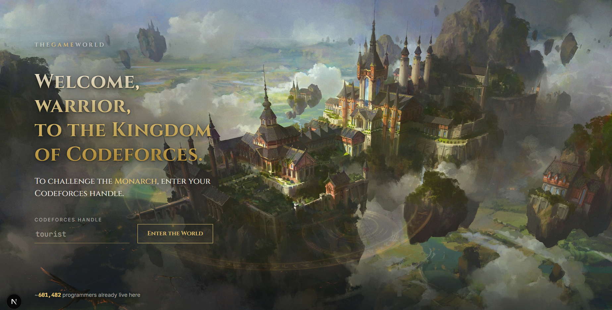

# 🌍 THEGAMEWORLD

> **Welcome to the world of competitive programmers.**

🌐 **Live Demo:** https://thegameworldofcoders.vercel.app

<p align="center">
  
</p>

---


## The Vision

Competitive programming is one of the best ways to become a better engineer.

Yet today it feels fragmented.

You solve problems on one website, participate in contests on another, discuss solutions somewhere else, and progress is represented by numbers on a profile.

**THEGAMEWORLD asks a different question.**

> **What if competitive programming felt like living inside a fantasy world?**

Imagine a persistent world where:

- 🏰 Every rating tier is a kingdom.
- ⚔️ Every contest is a world event.
- 👑 Every coder has an identity.
- 🗺️ Solving problems unlocks new lands.
- 🤝 Universities become guilds.
- 🌎 Players from around the world coexist inside the same universe.

Instead of opening another coding website, you enter **the world of competitive coders**.

---

## Current Version

Version 0 is a proof of concept that builds the foundation of this vision.

Currently it includes:

- Live Codeforces integration
- XP & progression system
- Arena system
- Custom titles
- Rating analytics
- Contest statistics
- Strongest & weakest topic analysis
- Fantasy-inspired world interface

The current goal is validating the core gameplay loop before expanding into a persistent multiplayer world.

---

## Tech Stack

### Frontend

- Next.js 15
- React
- TypeScript
- Tailwind CSS

### Backend

- Next.js API Routes
- Codeforces API

### Planned

- PostgreSQL
- Prisma
- Authentication
- Realtime multiplayer

---

## Roadmap

### Version 1

- User accounts
- Persistent profiles
- Interactive world map
- Guilds (universities)
- Global leaderboards

### Version 2

- Live multiplayer
- Daily quests
- Achievements
- Cosmetics
- World events
- Inventory

### Future

- LeetCode integration
- AtCoder integration
- CodeChef integration
- Company-sponsored tournaments
- Mobile application
- Open API
- Community mods

---

## Running Locally

```bash
git clone <repo>

cd version_zero

npm install

npm run dev
```

Visit:

```
http://localhost:3000
```

---

## Status

🚧 Active Development

This project is in its earliest stage, with the focus on building a polished foundation before expanding into a full game world.

---

## Author

Prince Aggarwal

Delhi Technological University (DTU)

---

_"Welcome to the world of competitive programmers."_
